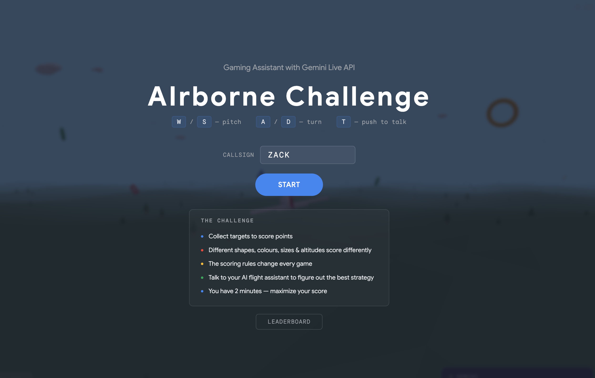
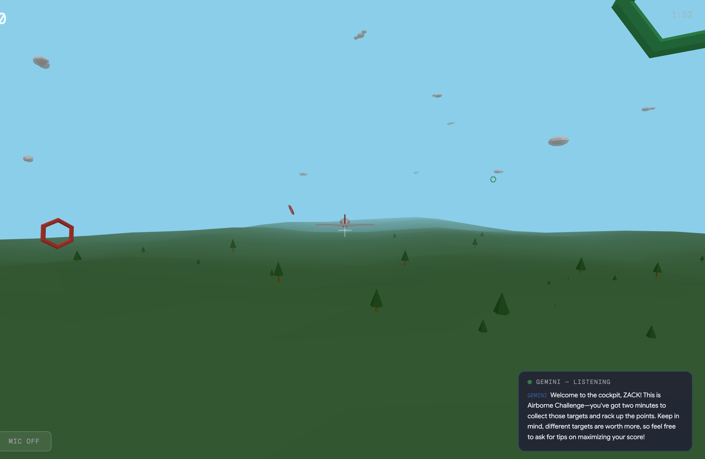
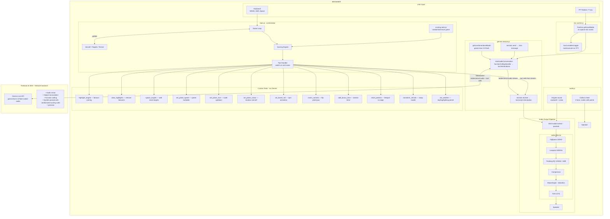

# AIrborne Challenge

A 3D flying game that demonstrates the [Gemini Live API](https://docs.cloud.google.com/vertex-ai/generative-ai/docs/live-api) as a real-time gaming assistant. Built with Three.js and [Firebase AI Logic](https://firebase.google.com/docs/ai-logic).

The player flies a plane collecting targets of different shapes, colours, sizes, and altitudes. The scoring rules are randomized every game and only the AI flight assistant knows them. Players must talk to Gemini to figure out the best strategy.




## Setup

1. Create a Firebase project and enable the Vertex AI API
2. Update `js/firebase-config.js` with your Firebase project config
3. Install and run:

```bash
npm install
./dev.sh
```

The app runs on `http://localhost:5173` via Vite dev server.

## How It Works

- Scoring rules (shape values, colour multipliers, size preference, altitude bonus) are randomly generated each playthrough
- The rules are passed to Gemini Live as a system prompt
- Players talk to their AI flight assistant via push-to-talk (T key or mic button) to learn the scoring secrets
- Gemini can highlight targets, spawn more, change the plane, and more via tool calling

## Controls

| Key | Action |
|-----|--------|
| W/S | Pitch up/down |
| A/D | Turn left/right |
| Shift | Boost |
| Space | Brake |
| T | Push to talk |

## Tech Stack

- **Three.js** — 3D rendering
- **Firebase AI SDK** — Gemini Live API (audio conversation + tool calling)
- **Web Audio API** — engine sounds, collect chimes, radio effect on Gemini voice
- **Vite** — dev server and bundling
- **localStorage** — leaderboard persistence

## Frontend Architecture



### Key Patterns

- **AudioContext monkey-patch**: `radio-effect.js` patches the `AudioContext` constructor *before* the SDK creates its own, inserting a filter chain on the destination node to give Gemini's voice a radio crackle
- **getUserMedia monkey-patch**: `mic-control.js` intercepts the SDK's mic request to capture the `MediaStreamTrack`, enabling push-to-talk by toggling `track.enabled`
- **session.receive() wrapper**: `gemini-session.js` wraps the async generator returned by `session.receive()` to intercept transcription messages and surface them in the UI
- **Randomized scoring**: `scoring-rules.js` generates a new formula each game (`shape_base × colour_mult × size_mult × altitude_mult`) and bakes it into the system prompt — the player never sees the rules directly

## Project Structure

```
js/
  main.js              — entry point, tool wiring, game loop
  config.js            — tunable game parameters
  input.js             — keyboard input
  aircraft.js          — plane model, physics, easter egg functions
  camera-controller.js — chase camera (scales with plane size)
  scene-setup.js       — renderer, scene, lights
  terrain.js           — ground, trees, collectible clouds
  targets.js           — shapes with varied colour/size/shape
  scoring-rules.js     — randomized scoring + Gemini system prompt
  game-state.js        — timer, score, game end
  hud.js               — minimal score/timer overlay
  audio.js             — synthesized engine + collect sounds
  radio-effect.js      — audio filter for flight assistant radio voice
  gemini-session.js    — Gemini Live connection + transcription
  mic-control.js       — push-to-talk mic muting
  autopilot.js         — menu screen idle flight
  leaderboard.js       — localStorage leaderboard
  firebase-config.js   — Firebase project config (add your own)
```
